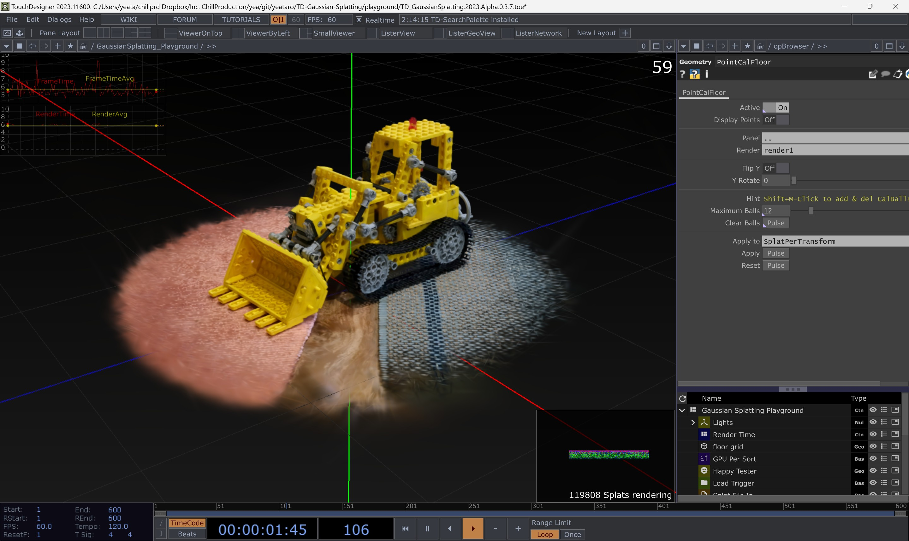
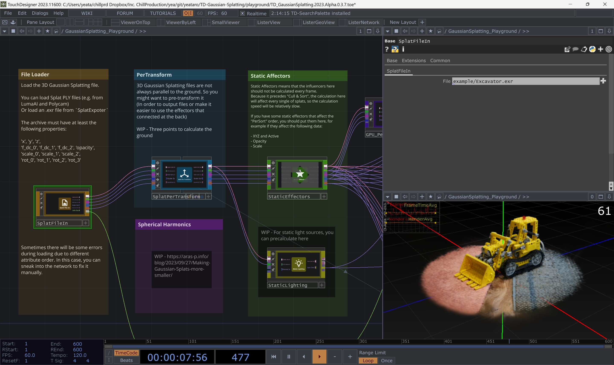
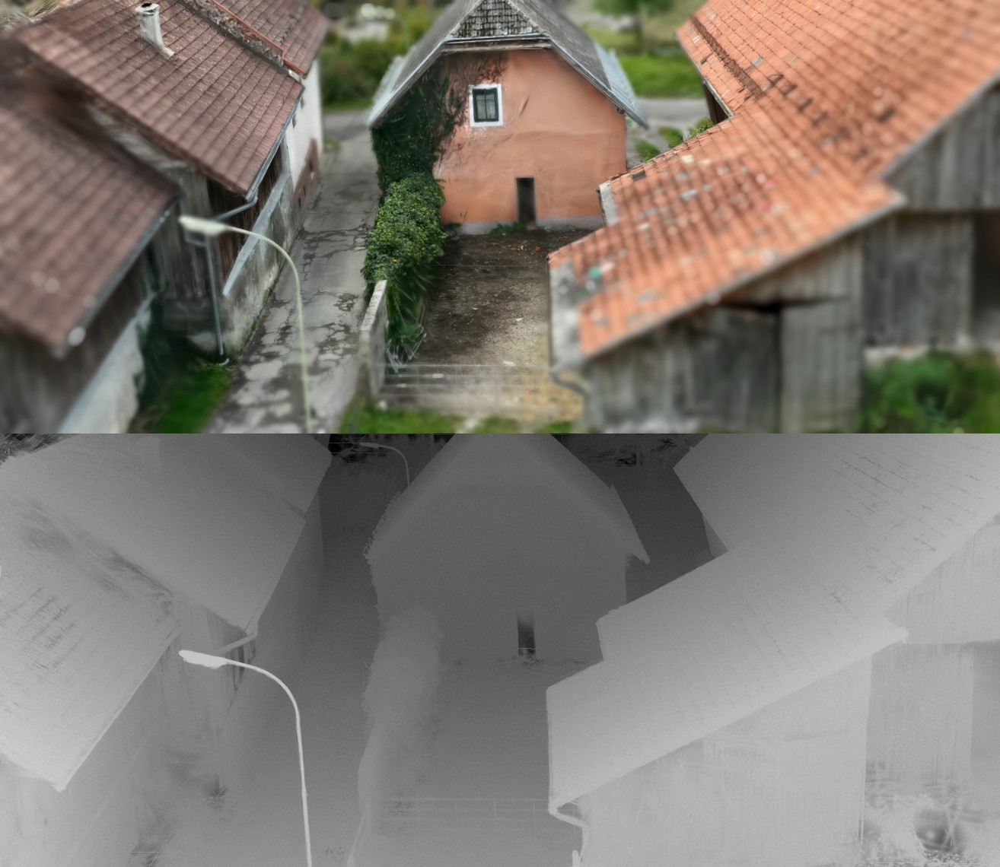
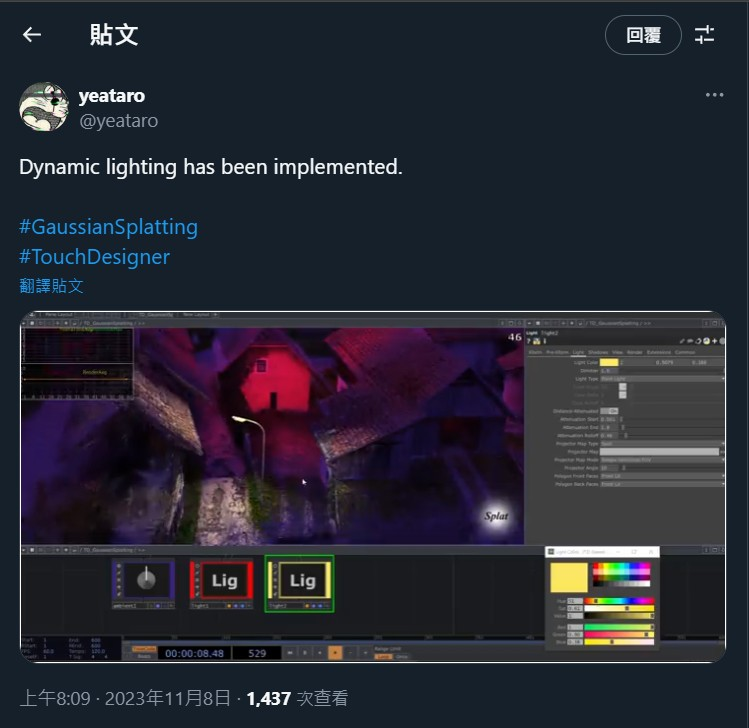
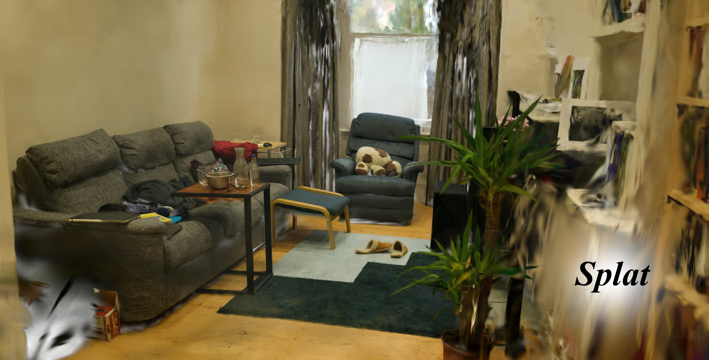
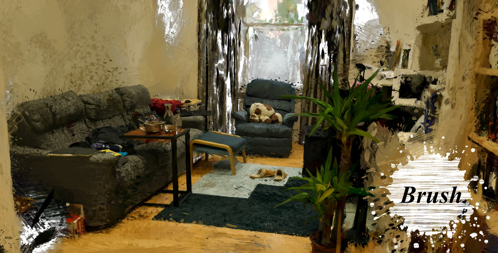

# Touchdesigner 3D Gaussian Splatting Toolkits

`This repository is switch to public for writing the wiki, please wait for the documentation to be completed.`

Touchdesigner implementation of a 3D gaussian rasterizer based on the paper : [3D Gaussian Splatting for Real-Time Radiance Field Rendering](https://repo-sam.inria.fr/fungraph/3d-gaussian-splatting/).

*The performance of the 2023 version project is significantly faster than the 2022 version

You can take a look at the things in the `/playground` first. There are demos of all current functions.

## Depth / Dof

## Relighting
https://x.com/yeataro/status/1722043516883210662

## Stylize

